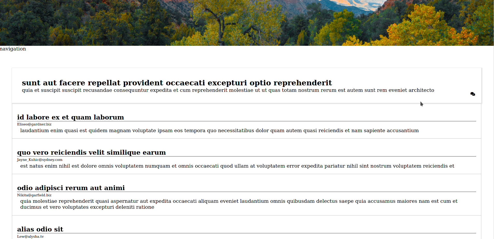

# Coding Challenge - AutoFI - Frontend ReactJS

Hello, i'm Maximiliano Leiva, can you call me Max. Nice to meet you! 

in this file i will go to try to document some steps i did to complete this code challenge.

## Installation

- Download this repository on your local machine with ***git clone***

- Run ***yarn install***

- Run **yarn start**

  

## Libraries used on this project

- React With typescript
- Redux for state management
- Redux-Saga for asynchronous calls.
- React-JSS for styling

## Design path

Because i don't want to spend a lot of time to building the UI, i take a forum template from the web for inspiration. There isn't so much work in design because this part of the process can take a lot of time to get good results.

## Notes

- i could have use a loader for fetching post, but looking at fetch not delay more than few milliseconds, i decide not add it
- Test are very simple
- I use a personal library who uses axios to fetch posts and comments
- To Add comments you need first to get comments from that post
- There are some points of improvement, specially on reducer part. And encountered some issues using React-JSS with typescript. If i went with styled components probably be better for next time
- Next.JS probably suits better for this application. Blogs and forums takes more advantage from CEO. I decided to use create-react-app because i work a lot more time with it, and i feel comfortable.

