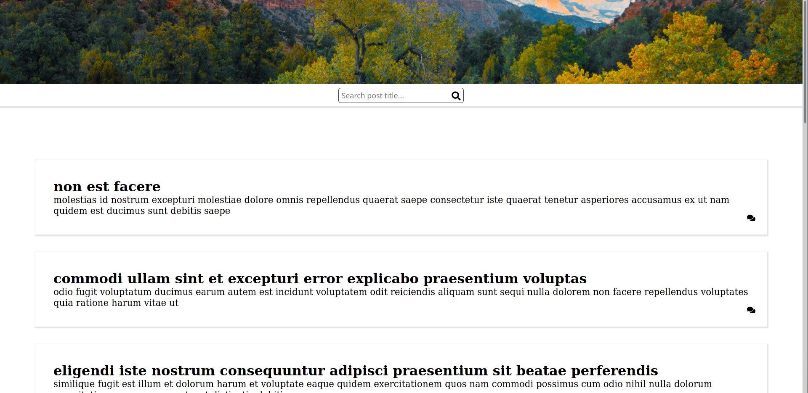

# Coding Challenge - AutoFI - Frontend ReactJS

Hello, I am Maximiliano Leiva but you can call me Max. Nice to meet you! 

In this file I will try to document some steps I did to complete this coding challenge.

## Installation

- Download this repository on your local machine with ***git clone***

- Run ***yarn install***

- Run **yarn start**

  

## Libraries used on this project

- React With TypeScript.
- Redux for state management.
- Reselect library to create special selectors.
- Redux-Saga for asynchronous calls.
- Styled-Components for component styling.

## UI Design

I used a forum template for the web for inspiration in the UI. I didn't spend a lot of time on the design because it's time consuming and I only got 3 hours to implement it fully.

## Design Considerations

- I could have used a loader for fetching posts, the fetch delay wasn't more than a few milliseconds, so I decided not to add it.
- I used a personal library which uses axios to fetch posts and comments.
- To Add comments you first need to click on the comments button from that post.
- There are a lot of improvements to be made, specially on the reducer part.
- Next.JS would have worked well for this application too. Blogs and forums takes more advantage of SEO. I decided to use create-react-app because I've worked a lot with it, and I feel comfortable using it.
- Added input for searching posts. This search field uses a filter on redux using reselect library. Other strategy could be using API backend to search the posts with a query parameter. We can also do filtering directly on the component.
- Passing the handler down to the input search we get a little prop drilling. I can use the dispatcher and launch the action directly on search component evading this issue, but i want to keep this component stateless. The strategy chosen in this place gives control to App stateful component.
- Created a debouncer custom hook to do a search with little delay between user typing. This is a must on search that would call the API.
- For posts filtering i use reselect library who searches on titles depending on the value of the search in redux.
- To make the code more easy to read and maintain in the future I moved parts of the app component to a custom hook.
- The received posts from the API counts a total of 100. To see all posts you must scroll a lot. To improve user experience i decided to add a custom pagination component.
- The pagination component only receives a handler for change event and total of posts. When the page or the size is changed, the component launches the handler. The handler is on app custom hook and dispatch change pagination action on the reducer.
- Added new selector for paginated posts, and this selector takes the returned value from previous created selector for searching over titles of posts.

